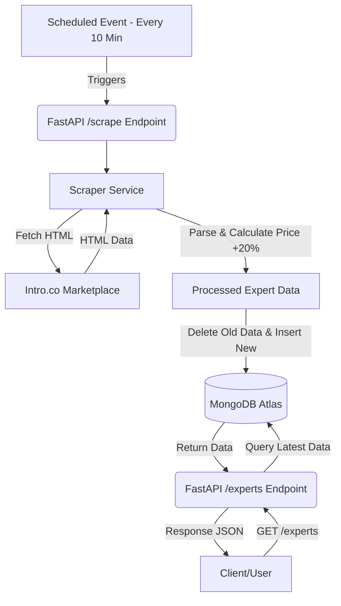

# Intro.co Marketplace Scraper & API Documentation

This document provides a comprehensive overview of the Intro.co Marketplace Scraper project.

## 1. System Architecture & Flow

The system consists of three main components: a **Scraper**, a **Database (MongoDB Atlas)**, and a **FastAPI Web Server**.

### System Flow Diagram

---

## 2. External Services & Credentials

To run this project, the following external services and credentials are required:

### A. MongoDB Atlas (Database)
Used for persistent storage of scraped expert data.
- **Required Credential**: `MONGODB_URI`
- **Format**: `mongodb+srv://<username>:<password>@<cluster>.mongodb.net/?retryWrites=true&w=majority`
- **Setup**: Create a cluster on [MongoDB Atlas](https://www.mongodb.com/).

### B. Vercel (Hosting & Scheduling)
Used to host the FastAPI application and trigger the 10-minute cron job.
- **Service**: Vercel Cron Jobs.
- **Required**: A Vercel account linked to your GitHub/GitLab repository.

---

## 3. Data Structure

Each expert record in the database contains the following fields:

| Field | Description | Example |
| :--- | :--- | :--- |
| `name` | Name of the expert | "Alexis Ohanian" |
| `base_price` | Original price from Intro.co | 2000.0 |
| `increased_price`| Price increased by 20% (Stored) | 2400.0 |
| `description` | Bio/Description of the expert | "Founder of Reddit..." |
| `link` | Direct link to expert profile | "https://intro.co/AlexisOhanian..." |

---

## 4. Deployment Instructions

1. **Environment Variables**: Set the following in your Vercel project settings:
   - `MONGODB_URI`: Your MongoDB connection string.
   - `DB_NAME`: The database name (default: `intro_scraper`).
   - `COLLECTION_NAME`: The collection name (default: `experts`).

2. **Cron Configuration**: The `vercel.json` file in the project root handles the 10-minute scheduling automatically.

---

## 5. Local Setup Reference

If running locally:
1. Initialize `.env` with your MongoDB credentials.
2. Install dependencies: `pip install -r requirements.txt`.
3. Run: `python main.py`.

---

*Generated by AI Assistant for client handoff.*
